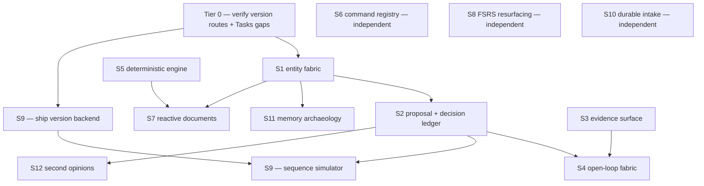

# THE CONVERGENCE LEDGER — Cursor

**Date:** 2026-09-06
**Author:** Claude (Desktop), synthesis pass
**Mode:** Combined ranking + technical specification. Read-only research against pinned commits below; nothing in this document has been implemented.
**Inputs:** "The Life Hub Dossier" (70 discoveries: Claude's precedent-first pass, Cursor's own `OPEN_CAPABILITY_DISCOVERY_CURSOR.md` in this repo, and ChatGPT's clerical-labour pass) + a prior Codex synthesis attempt ("Life Hub: a unified discovery and development roadmap," 2026-09-06, ranked R01–R15) that ran out of budget and stopped mid-writeup at R06.
**Verified against:** `life-hub@d9d0f55c19550c8e0891a2babb036202ad07f2ba`, `life-hub-data@6671673281ba1a571f5d4c3e6b41e5b505833b38`, `knowledge-hub-data@311c6035f6cb9c0173f32bbd03e60e61151b4631` — cloned and grepped directly, not assumed from the dossier's earlier pinned snapshots.

---

## 0. What this document is, and isn't

Codex tried to fold all 70 dossier discoveries into one ranked, technically-specified plan and ran out of tokens after six of fifteen ranks. This redoes that synthesis pass — same discoveries, recombined by hand, checked line-by-line against current `main` in `life-hub`, `life-hub-data`, and `knowledge-hub-data` rather than a pinned snapshot or the dossier's own prose.

Three things fell out of reading the actual code that weren't visible from the dossier alone:

1. **Two of Codex's ranks are the same code path.** "Reversible proposals" (R02) and "decision memory" (R04) look like separate projects from the dossier's abstractions. They are one pending-queue → confirm → audit-log mechanism once you read `netlify/functions/chat-confirm.mjs`. Building them separately duplicates the allowlist and audit machinery. Merged below into **S2**.
2. **Some things Codex called unverified are shipped, just narrow.** A real "oldest open loop" line already renders on Life's home screen (`apps/life/js/app/home-model.js`). Teaching's version-history frontend is fully built end to end with **zero** matching backend route — the cheapest, highest-leverage gap in this document, and Codex's table gave it one line.
3. **Some things Codex called gaps are confirmed gaps, with an exact citation now.** `docs/consolidation/plan.md` states, dated to the Sept 4–5 fold: *"Fixed on life-hub2: GET/POST /api/reviews, GET/PUT /api/task-properties. Still missing if those views are used: /api/capacity, /api/stress-flags."* Two of four flagged gaps are already closed; two remain, by the plan's own account.

**Provenance key** used throughout: `D01–D28` = Claude's pass, `C01–C30` = Cursor's own pass (this repo's `OPEN_CAPABILITY_DISCOVERY_CURSOR.md`), `G01–G12` = ChatGPT's pass. `Rxx` = Codex's ranking, where a mapping exists.

---

## 1. The combined ranking — twelve builds, not fifteen

Strategic value order, not a build queue — same caveat the dossier and Codex both made, still true. Three of Codex's fifteen ranks fold into neighbours below (R10's teaching half → S9, R13 → S12, R14 → S12); three more (bitemporal truth, the standalone problem list, weak-tie canvases) are demoted to §3 ("explicitly folded") rather than padded in to make fifteen.

| # | Capability | Combines | First-slice effort | Codex ref |
|---|---|---|---|---|
| S1 | Cross-hub entity & identity fabric | D06 D15 D20 · C05 C19 · G01 G02 | M | = R01 |
| S2 | Unified proposal & decision ledger | D02 D08 D22 D24 D25 · C03 C04 C14 C27 · G06 | M (was L+M) | = R02 + R04, merged |
| S3 | Evidence & context integrity surface | D09 · C21 · G08 | S–M | = R03 |
| S4 | One open-loop / quiet-attention fabric | D27 · C08 C17 C29 | S–M (partly shipped) | = R05 |
| S5 | Deterministic engine under the agents | D03 D16 D18 D23 · C01 C12 C22 C28 · G03 G04 | M | = R06 + R09's solver half |
| S6 | Command registry & ephemeral action UI | C09 C10 C18 | S (mostly UI) | = R07 |
| S7 | Reactive computational documents | D07 · C11 C15 · G05 | M — sequenced after S1/S5 | = R10 |
| S8 | FSRS-generalized resurfacing | D12 · C07 · G10 | S — latent, not new | = R11 |
| S9 | Teaching rehearsal & sequence simulation | D17 D24 · C16 | S (backend), M (simulator) | = R09's teaching half |
| S10 | Durable intake & learned filing | D21 · C30 · G07 G12 | M–L | = R08 |
| S11 | Memory archaeology & history navigation | D06 D21 D25 · C06 C20 | sequenced, not scoped | = R12 |
| S12 | Structured second opinions & source watches | D14 D19 D28 · C13 · G11 | S + S (independent halves) | = R13 + R14, merged |

---

## 2. Tier 0 — verify before any of the twelve

### T0.1 — Ship Teaching's version-history backend (near-free)

**Verified gap:** `apps/teaching/src/teacher/version-api.ts` already defines the full contract: `GET/POST /api/lessons/:id/versions`, the same for `units` and `classes`, plus `/versions/:revision` and `/versions/:revision/restore` — consumed by a real `history-panel.ts` and typed by `schemas/version.ts`. No file matching `*version*` exists anywhere under `netlify/functions/`. Schema, frontend, and UI are sunk cost; only four backend routes are missing.

**Do this:** implement the four routes against `teaching-blobs.mjs`'s existing store, one blob per `{kind}/{parentId}/versions/{revision}`. Unlocks S9 immediately and de-risks S2's partial-accept pattern, since Teaching's `ai_accept` is already the one place in the codebase where partial-accept precedent exists.

### T0.2 — Confirm Tasks' capacity / stress-flag status (10 minutes)

**Verified, dated:** `docs/consolidation/plan.md`, post-fold section (2026-09-04/05): *"Fixed on life-hub2: GET/POST /api/reviews, GET/PUT /api/task-properties. Still missing if those views are used: /api/capacity, /api/stress-flags."* Two of four flagged gaps already closed since the dossier was written; two remain open, by the plan's own account.

**Do this:** grep `netlify/functions/` for those two routes before S4 or S5 assume Tasks stress signals are pluggable — they aren't yet.

---

## 3. The twelve, in full

### S1 — Cross-hub entity & identity fabric (effort M)

`D06` content-addressed memory · `D15` operational ontology · `D20` entity-link-property investigation · `C05` Gramps-style object fabric · `C19` entity resolution · `G01` context capsules · `G02` entity reconciliation

**Grounded in code:** every hub already has *an* id; none share one. Tasks records key off `TASK_PREFIX` blob paths (`tasks-blobs.mjs`); Teaching off `CLASS_PREFIX`/`SCHEDULED_LESSON_PREFIX` (`teaching-blobs.mjs`); Knowledge pages get a real generated id and already carry a link array — `saveKnowledgePage()` in `knowledge-data.mjs` stores `connected: []` pointing at other pages. Life is the outlier: a record's only "identity" is its canonical path, built from `{type, date, slug}` in `chat-schema.mjs`'s `buildCanonicalPath` — no durable id survives a rename at all.

**First slice:** don't build a graph database. Extend Knowledge's existing `connected` array — the only hub that already models cross-references — to hold typed foreign refs (`{hub:'tasks', id:'proj_xyz'}`) instead of only other-page ids. Pick one real pair people actually cross-reference (a Teaching unit ↔ its Knowledge sources ↔ a Tasks project) and wire that one path end to end before generalizing.

**Why S1:** the single strongest convergence in the 70-idea corpus — three passes, three different methods (precedent search, live-code audit, clerical-labour framing), each named this their own #1 or #2 pick unprompted. Verified in code: it's real ground zero, not an assumed one — Life has nothing to extend, Knowledge has almost enough to extend from.

### S2 — Unified proposal & decision ledger (effort M)

`D02` problem list · `D08` life worktrees · `D22` decisions as objects · `D24` non-destructive rehearsal · `D25` edit decision list · `C03` confirmable branching · `C04` preview/undo kit · `C14` decision ledger · `C27` partial-accept diff · `G06` proposal branches

**Grounded in code — more built than either dossier pass assumed:** `netlify/functions/_shared/capabilities/propose-action.mjs` already validates a structured, per-agent-allowlisted, multi-write proposal (the `os_propose_action` tool schema), queues it at `data/os/pending-actions.json` (30-entry FIFO cap), and — on confirm, in `chat-confirm.mjs`'s `handleActionConfirm` — re-checks the allowlist, applies the writes, and **already appends a typed entry to the governance log** on both approval and rejection (`appendGovernanceEntry`, `data/governance/governance-log.md`). A second, narrower version of the identical pattern exists just for Central Node (`hammond-tools.mjs`'s `classifyCentralNodePatchRisk`, `cn-patch-queue.mjs`), with its own queue and TTL purge.

**Real, verified gaps:**
1. Confirm re-reads the file's *current* sha via `client.resolveTree()`, never the sha Adam actually saw when the proposal was shown — no genuine staleness check exists, despite this being exactly the gap Codex's roadmap described.
2. `executeProposeActionWrites` applies its whole `writes[]` array as one unit — there is no per-write partial accept, which is C27's actual, specific gap.
3. The executor only writes through the GitHub client — it has no path into Tasks' or Teaching's Netlify Blobs stores, so today it can only branch Life's git-backed markdown, not the Tasks/Teaching state C03 and G06 both want branched.

**First slice:** three concrete, small changes rather than a new system: capture the write-target sha(s) inside the queued entry at propose-time and diff against current at confirm-time; add a second Blobs-backed executor beside the GitHub one, same validate→queue→confirm shape; promote the governance log's existing typed, dated, status-bearing entries (`parseGovernanceEntries`, `openGovernanceEntries` already exist) into the actual decision object — `chosenOption`/`rationale`/`assumptions`/`reviewAfter` — rather than free prose.

**Why merged, why S2:** Codex ranked "reversible proposals" and "decision memory" as separate items because it read the dossier's abstractions. Reading `chat-confirm.mjs` shows they're the same pending-queue-plus-confirm-plus-audit mechanism already serving two object types — building them as two projects duplicates the allowlist and audit machinery. This is the clearest instance of "combine, don't just re-rank" in this document.

### S3 — Evidence & context integrity surface (effort S–M)

`D09` chain of custody · `C21` evidence-chain explainability · `G08` agent flight recorder

**Grounded in code:** `.cursor/rules/agent-context-integrity.mdc` already codifies the exact four-part contract this rank asks to surface — Availability, Delivery, Interpretation, Behaviour — but today it's an engineering discipline enforced in review and tests, invisible to Adam. `hub-agent-context.mjs`'s `safeList()` swallows every list failure into `[]` and caps context at `TASK_CAP=12, CLASS_CAP=12, LESSON_CAP=10, WINDOW_DAYS=14` — a real, load-bearing silent-failure point exactly where the rule's "no silent context loss" clause bites.

**First slice:** change `safeList`'s return shape from a bare array to `{status:'available'|'unavailable'|'partial', rows, omitted}` and thread that through `formatHubAgentContext` so a capped or failed source is visible in the assembled context string itself — the smallest possible instance of the ACI rule's own "fail-visible truncation" requirement, applied to code that already violates it.

**Why S3:** turns an existing internal discipline into a user-facing surface. Nothing here is greenfield design — the contract and the exact violation are both already written down.

### S4 — One open-loop / quiet-attention fabric (effort S–M)

`D27` attention as routing · `C08` selective ambient attention · `C17` open-loop fabric · `C29` staged delegation chains

**Grounded in code — partly shipped already:** `apps/life/js/app/home-model.js`'s `buildHomeModel()` already calls `oldestOpenGovernanceEntry(governanceLogMarkdown, date)` and renders one real line on Life's home screen: `"Hammond: <title> — Nd open."` That's a live, shipped instance of exactly this capability — just narrow. It sees one source; C17 names five scattered ones: CN cross-agent lines, governance loops, Clare's "Later" list, stale CN Flags, and Tasks stress-flags (once T0.2 ships).

**First slice:** extend `oldestOpenGovernanceEntry`'s input from one markdown string to an array of `{source, items}` and merge-sort by age before picking the one shown. The ranking logic already works; it needs more sources plumbed in, not a new attention engine.

**Why S4:** the existing single-line surface is production proof the mechanism works. The gap is breadth of sources — exactly why Cursor's own pass separately flagged this as its Sleeper.

### S5 — Deterministic engine under the agents (effort M)

`D03` hypothesis matrix · `D16` solver not vibe · `D18` causal models · `D23` the differential · `C01` baseline drift engine · `C12` decision workbench · `C22` week composer · `C28` pattern miners · `G03` query engine · `G04` constraint-solving

**Grounded in code:** Life's time-series data is already flat, dated markdown under `data/{nutrition,fitness,body,mind,skincare}/YYYY/MM/`, matched by `repo-policy.mjs`'s `EVENT_PATH` regex — genuinely queryable with no new storage. Nothing today computes a rolling baseline or drift signal over it; every agent narrates from raw context, never from a computed result.

**First slice:** one deterministic function — weekly workout-completion counts for the last 8 weeks vs. the preceding 8, computed in plain JS over `workout-history.mjs`'s already-parsed records, returned as a typed object distinguishing missing dates from real zeros. Bounded native JS before DuckDB-Wasm is ever justified.

**Why S5:** ten discoveries across all three passes make the identical warning — the agent must narrate, never invent, the arithmetic. That's unusual convergence to ignore, and the underlying data is confirmed flat and parseable today, so the ceiling here is query-writing effort, not new infrastructure.

### S6 — Command registry & ephemeral action UI (effort S)

`C09` schema-constrained ephemeral interfaces · `C10` command registry architecture · `C18` promoted shortcut runtime

**Grounded in code:** `capabilities/registry.json` plus `registry.mjs`'s `loadCapability()` already load a typed definition per capability id, and `intent-router.mjs` already keyword-matches free text to capability ids via regex hint lists (e.g. `/challenge/i` → `track.open-challenge`) — a real, if crude, command-routing layer exists today. `capabilities/os/{promote-shortcut,list-promoted-shortcuts,run-promoted-shortcut}.json` show shortcut promotion is already modeled, just with no user-facing view.

**First slice:** a `/shortcuts` panel over `list-promoted-shortcuts`'s existing output with a run button hitting `run-promoted-shortcut` — a UI over a contract that's already defined.

**Why S6:** the closest thing in this document to "just build the UI." The registry, schemas, and routing keywords already exist.

### S7 — Reactive computational documents (effort M, sequenced after S1/S5)

`D07` live scrubbable notes · `C11` reactive computational documents · `C15` live cross-hub queries · `G05` reactive computational blocks

**Grounded in code:** genuinely the least-grounded rank here. The nearest precedent is Teaching's sandboxed `html_app` block (`html-app-ai.mjs`/`html-app-providers.mjs`) — arbitrary sandboxed HTML with no live data-binding back to any Life Hub record.

**First slice:** deliberately deferred — a reactive block needs a stable object to bind to (S1) and a safe typed query surface to bind through (S5). Building it before either lands means redoing the binding layer once they exist.

**Why S7:** the third pass to independently propose the identical mechanism — real convergence, ranked mid-table on value but explicitly downstream on sequencing.

### S8 — FSRS-generalized resurfacing (effort S, latent not new)

`D12` your own forgetting curve · `C07` contextual serendipity · `G10` forgetting-science resurfacing

**Grounded in code:** `apps/knowledge/src/quiz/review.ts` runs a real `fsrs()` scheduler from the `ts-fsrs` package via `applyRating()`, storing a full `FsrsCard` (due/stability/difficulty/reps/lapses/state) per quiz item — scoped only to harvested quiz cards, never notes, diary entries, or general Knowledge pages.

**First slice:** attach an `FsrsCard` (the exact same type from `quiz/schema.ts`) to a Knowledge page directly, updated on "resurfaced and opened/dismissed" instead of a quiz rating, and use its `due` field to pick one candidate for a "you last touched this 11 months ago" rail card.

**Why S8:** the highest-confidence "latent, not speculative" item in the whole corpus — the scheduler is production code today. This is a scope extension of an existing dependency, not new science.

### S9 — Teaching rehearsal & sequence simulation (effort S then M)

`D17` rehearsing the future self · `D24` non-destructive rehearsal · `C16` teaching sequence simulator

**Grounded in code:** see T0.1. The single biggest "nearly free" gap in this whole audit. The version-history contract, frontend and types are fully built; only the four backend routes are missing. Once those exist, C16's actual ask — comparing *alternate future* orderings, not just restoring past ones — is the natural next step.

**First slice:** ship T0.1 first. Then a compare view over two candidate unit sequences, scored on outcome coverage and schedule collisions, writing an accepted sequence through S2's proposal ledger rather than a direct write.

**Why S9:** ranked below S1–S6 on strategic value — it's Teaching-only, narrower than the cross-hub items above it. But its first slice is unusually cheap relative to payoff, since three of four normal cost centers (schema, frontend, UI) are already sunk cost — worth pulling forward in build order even though its portfolio rank is lower.

### S10 — Durable intake & learned filing (effort M–L)

`D21` self-writing finding aid · `C30` personal transform pipelines · `G07` durable long-running jobs · `G12` learned intake and filing

**Grounded in code:** `ai-job.mjs`/`ai-jobs.mjs` create/read/resolve job records but have no crash recovery or multi-stage state machine — a queue, not a workflow engine, confirming Codex's read. `chat-job-store.mjs`/`chat-job-run.mjs` is a closer analog (an actual background runner plus polling) but scoped to chat only.

**First slice:** pick one real multi-stage case already implied by the corpus — Knowledge's existing tidy/tag pipeline (`knowledge-tidy.mjs`, `knowledge-tidy-tags.mjs`) — and give it an explicit state machine (`queued → extracting → classifying → awaiting_review → done`) persisted beside the job record, rather than building a generic workflow engine first.

**Why S10:** two different job mechanisms already exist for two different purposes; before forking a third, worth checking whether `chat-job-run.mjs`'s runner generalizes.

### S11 — Memory archaeology & history navigation (sequenced, not scoped)

`D06` content identity · `D21` finding aid · `D25` edit decision list · `C06` memory archaeology · `C20` history scrubber

**Grounded in code:** none directly — this rank depends entirely on S1 (a stable thing to trace) and S2 (a place decisions are actually recorded) existing first.

**First slice:** honestly, none yet. Don't scope this until its two dependencies land — anything built earlier gets rebuilt.

**Why S11:** real value, explicitly downstream. Ranked here because nothing in the current code shortens its path, not because the idea is weak.

### S12 — Structured second opinions & source watches (two independent S's)

`D14` adjudicated disagreement · `D19` right to speak up · `D28` the red team · `C13` structured personality disagreement · `G11` "watch this source"

**Grounded in code:** Central Node's own "Cross-Agent Coordination" section in `central-node.md` is already where personality-to-personality mail lives, in prose — C13's split-pane shared-evidence view is a structured UI over a channel that already exists informally. Source watching (G11) has zero code precedent: nothing in `knowledge-research.mjs` or the R2 research Worker currently polls an external source for change.

**First slice:** two small, independent slices, not one: (a) a two-column view for one named decision type (training during a flare), sourced from S2's decision object as the shared evidence pack; (b) hold off on source-watching until one real Knowledge source demonstrates it's worth the polling infrastructure.

**Why last:** genuinely useful, deliberately bottom — least load-bearing for anything else here, and G11 in particular has no existing hook to build from.

---

## 4. Explicitly folded, not padded in

- **D01 Bitemporal Truth · D13 State as Replay** — both dossier passes' own reconciliation already resolves this: event-source only the *new* objects this document proposes (S2's decision/proposal/version records) — never migrate existing Life markdown wholesale. An implementation detail inside S2 and S9, not a standalone build.
- **D02 The Problem List** — `central-node.md`'s "Current Constraints & Priorities" and "Long-Term Trends & Patterns" sections are already an unstructured problem list. Folded into S2 as the ledger's case grouping.
- **D03 Hypothesis Matrix · D23 The Differential** — real, but they're query templates over S5's deterministic engine, not separate infrastructure.
- **D10 Facets Not Folders · D11 Weak-Tie Canvas · C26 Dissolving Spatial Workspaces** — genuine knowledge-organization ideas with no urgent code hook right now — left out of the ranked twelve deliberately, in the same spirit as the source dossier's own "Don't Build This" section, rather than padding the count.
- **D26 Hypervideo Annotation · C24 Passage↔Block Provenance · C25 Multi-Scale Information Architecture** — real, Teaching-specific value — but narrower than everything ranked S1–S12 and downstream of S1+S9. Worth a dedicated pass once those two land, not forced into this one.

---

## 5. Build order (dependency map, not value order)

---

Fifteen ranks made the dossier's convergence legible. Twelve makes it buildable — the other three weren't dropped, they were finally in the same place the code already put them.
